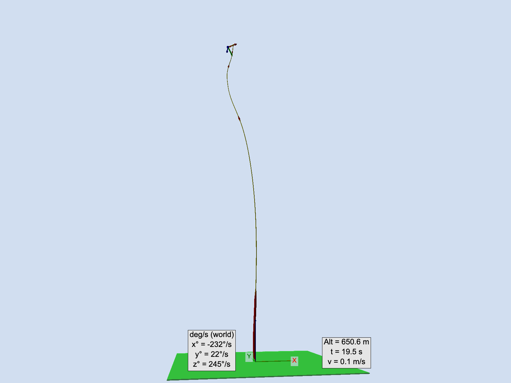

# IMU flight data analysis

This is a post-flight analysis pipeline using results from a fused 9 DOF Quaternion, Accelerometer & Gyrometer.

It is based on a post-flight analysis pipeline using results from a 6 DOF Accelerometer & Gyrometer.
The 6 DOF data means that we have to estimate quaternions and remove gravity from acceleration data.

## Running Analysis and Animation:

Either use run function in PyCharm or run python to creates plots in ./plots and frames in ~/Downloads:

    $ python3 analysis.py

Run script to create video in ./video from ~/Downloads/frame_0000.png to ~/Downloads/frame_00xx.png 
    
    $ ./video-create.sh

## Credits - Many Thanks!
THANKS to Carlos Montalvo! You have an awesome video and GitHub repo!

https://github.com/cmontalvo251/aerospace/blob/main/rockets/PLAR/post_launch_analysis.py
https://www.youtube.com/watch?v=mb1RNYKtWQE

## Original Rocket Flight Analysis:

We used Carlos Montalvo's flight data and original analysis pipeline code to create this code. 
In addition, we created a VPython code to animate the flight data. This animation also shows the flight path trail.
Based the vertical acceleration data, we show the trail in a thick/red trail during high-acceleration which we assume is thrust.
The flight trail is shown as a thin/yellow trail during coasting.
One of the things we noticed is that after the thrust phase that the rocket started to invert and near apogee it is actually nose down.
Our theory is that the rocket's center-of-gravity and the center-of-pressure for the rocket were too close.

```
--- Six DOF Processing START
Files:
	Data File: ./raw_input_data/launch_data.txt
	Plot Directory: ./plots
Flight Data:
	Averate Data Freq: 4.24 Hz
	Average time step: 0.2359 seconds (235.9 msec)
	Min/Max interval: 217.0 ms / 404.0 ms
	Standard Dev: 28.0 ms, jitter: 12%
	Detected Launch: 874.60s
	Detected Chute Deploy: 895.00s
	Flight Duration: 20.40s
	Est max acceleration error due to 4" offset: 5.45 m/s², 56%
--- Six DOF Processing END

Calculated Flight Data:
	Max altitude: 650.6 m
	Max velocity: 63.3 m/s
	Max acceleration: 39.2 m/s^2, 4.0 g
```
## Images from Video

t = 3.0 sec after launch right before thrust phase ends.


t = 6.3 sec, in coast phase the rocket starts to tumble at apogee it is nose down.


t = 19.5 sec, maxium height of 650.6m is reach, tumbling is excessive. Upward velocity goes to zero.



## Video Output

Video created using VPython to animate the flight data:

https://github.com/user-attachments/assets/4173820f-55c1-4e17-9c7e-8f5143287e7d


Rocket IMU data notes:
- There was significant clipping of accelerometer results during launch andlikely altitude and velocity are wrong.
- The average 236 msec sampling rate is slow for this analysis to be accurate.
- There is an "acceleration event" at t=9.6s after launch (883s) and at (888s). We are not sure what these are. Likely one of these is chute deploy.
- Sensor data is a bit wonky post-apogee, accurate analysis after time this is confusing.

# New Analysis pipeline for fused-9-DOF BNO086 Post-Flight Analysis

## 1. BNO086 Sensor Frame (Body Frame) [ log_linacc_quat_gyro_flash_spi.py ]

```
The physical sensor orientation on the projectile.
	+X (Roll): Sensor Right (i component)
	+Y (Pitch): Sensor Forward (j component)
	+Z (Yaw): Sensor Up (k component)
	time_stamps in milliseconds (0.1 msec resolution)

Output CSV FILE:
	a_body: linear_acceleration (HW-fused, gravity removed).
	quat_final:   quaternion (Body → World)
	g_final:   quaternion (Body → World)
	time_stamps in SECONDS (0.0001 sec resolution)
```

## 2. Rigidbody / CoG Correction (Body Frame) [read_prepare_9_dof.py] 
```
Before moving to world coordinates, we correct for the sensor offset.
	Input ω: Must be [X,Y,Z] order → [gr, gp, gy]
	Vector r: [sensor_offset, 0, 0] (Offset along the Right/Roll axis)

CoG Correction:
	a_cg = a_sensor −(α×r)−(ω×(ω×r))

Output:
	a_f = a_cg is still in the Body Frame
```

## 3. Inertial / World (Analysis Frame) [analysis.py] 
```
Applying q_bw to a_cg to find true motion relative to the ground.
	+X I (Down-range): North/East or Launch direction.
	+Y I (Cross-range): Left/Right drift.
	+Z I (Altitude): Up (Vertical).

Double Integration:
	v_world = ∫ a_world dt
	p_world = ∫ v_world dt
```

## 4. VPython Display (Visual Frame) [animate_projectile.py] 
```
Mapping the Analysis Frame to VPython’s Screen Coordinates.
	VPython +X: Right (Screen) ← Analysis X (Down-range)
	VPython +Y: Up (Screen) ← Analysis Z (Altitude)
	VPython +Z: Toward User ← Analysis Y (Cross-range)

Code for Position: 
	pos = vector(px_f, pz_f, py_f)
	a_z = az_I = acceleration up

Code for Orientation: 
	VPython's pointer or axis uses the same remap: 
	obj.axis = rotate(vector(1,0,0), quat) 
		where the vector is remapped to match the visual world.
```

## Axes Summary Table for Code Consistency
```
Quantity        Body	Analysis(Inertial)  VPython
Forward/Up       +Y           +Z              +Y
Right/Downrange  +X           +X              +X
Vertical/Cross   +Z           +Y              +Z
```
