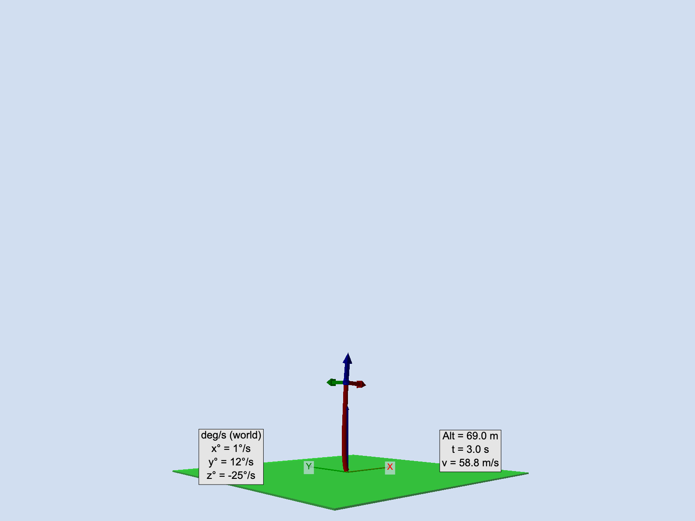
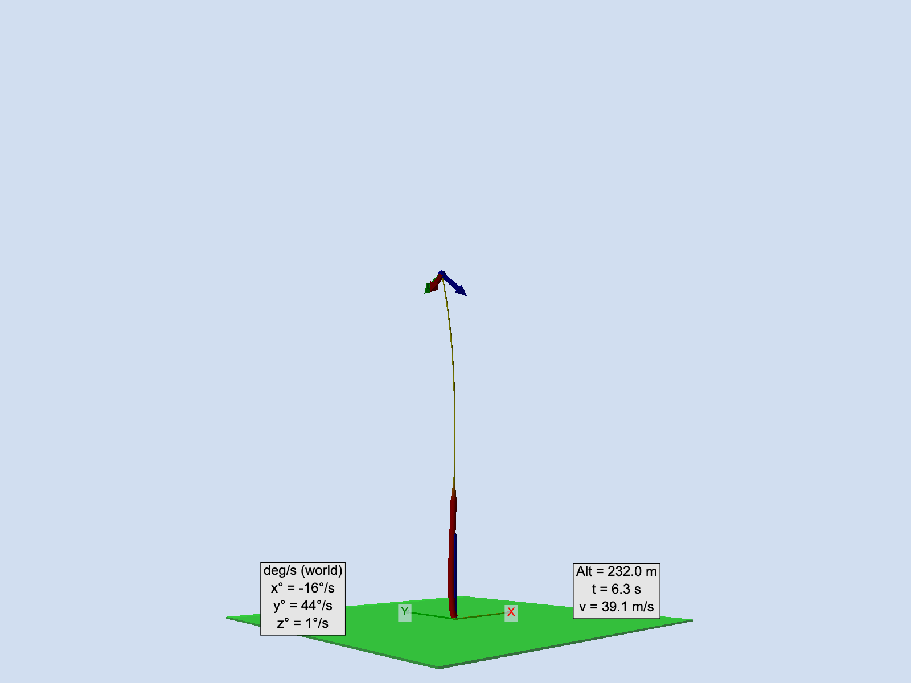
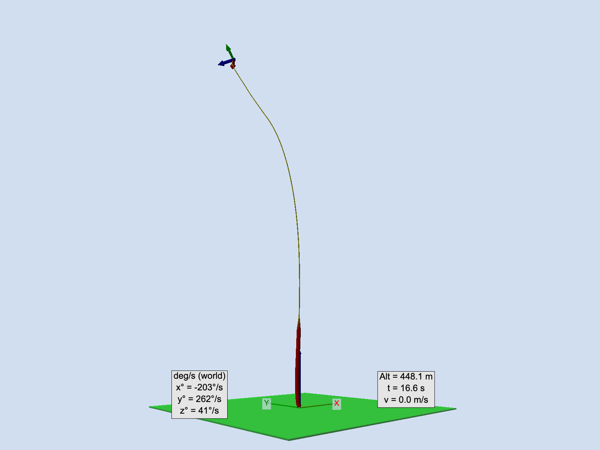

# IMU flight data analysis

Analysis of Quaterniion, Accelerometerm & Gyrometer Fused 9 DOF data pipeline analysis.

Analysis of Accelerometer & Gyrometer 6 DOF data pipeline analysis. 
For 6 DOF, we have to estimate quaternions and remove gravity from acceleration data.

## Running Analysis and Animation:

Either use run function in PyCharm or...

Run python to creates plots in ./plots and frames in ~/Downloads:

    $ python3 analysis.py

Run script to create video in ./video from ~/Downloads/frame_0000.png to ~/Downloads/frame_00xx.png 
    
    $ ./video-create.sh

## Original Rocket program output (Monte Carlos' flight data):

We used Monte Carlos' flight data and original code to create this code. 
In addition, we created a VPython code to animate the flight data. This animation also shows the flight path trail.
Based the vertical acceleration data, we show the trail in a thick/red trail during high-acceleration which we assume is thrust.
The the flight trail is shown as a thin/yellow trail during coasting.
One of the things we noticed is that after the thrust phase that the rocket started to invert and near apogee it is actually nose down.
Our theory is that the rocket's center-of-gravity and the center-of-pressure for the rocket were too close.

```
--- Six DOF Processing START
Files:
	Data File: ./raw_input_data/launch_data.txt
	Plot Directory: ./plots
Flight Data:
	Averate Data Freq: 4.24 Hz
	Average time step: 0.2359 seconds (235.9 msec)
	Min/Max interval: 217.0 ms / 404.0 ms
	Standard Dev: 28.0 ms, jitter: 12%
	Detected Launch: 874.60s
	Detected Chute Deploy: 889.50s
	Flight Duration: 14.90s
	Est max acceleration error due to 4" offset: 7.09 m/s², 72%
--- Six DOF Processing END

Calculated Flight Data:
	Max altitude: 448.1 m
	Max velocity: 59.3 m/s
	Max acceleration: 39.2 m/s^2, 4.0 g
```
## Images from Video

t = 3.0 sec after launch right before thrust phase ends.



t = 6.3 sec, in coast phase the rocket starts to tumble at apogee it is nose down.



t = 16.6 sec, at apogee the tumble increases. In addition, at the chute deploy explosion, the sensor seems to head higher.



## Video Output

https://github.com/user-attachments/assets/0738fe81-0436-4e07-a915-c6b6682752a6

Rocket IMU Data issues:
- There was significant clipping of accelerometer at launch, likely altitude and velocity wrong
- The sampling rate is low at average of ~250 msec
- Gyro shows lots of tumbling after chute explosion deploy, it seems to have pushed the sensor hight !?
- Sensor data is a bit wonky post-apogee, accurate analysis after this is difficult

## Credits - Many Thanks!
THANKS to Monte Carlos! You have an awesome video and GitHub repo!
https://github.com/cmontalvo251/aerospace/blob/main/rockets/PLAR/post_launch_analysis.py
https://www.youtube.com/watch?v=mb1RNYKtWQE
